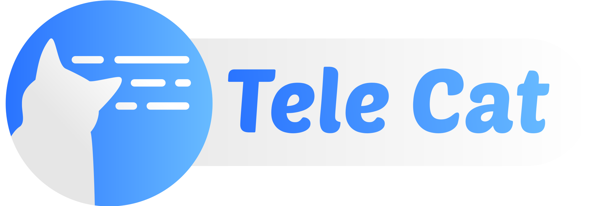

    

<h1 align="center">TeleCat</h1>

Best Open Source Teleprompter App for you and your cat😺! 
 

<b>Status:</b> <code style="color : red">Alpha</code>

## Technologies run-down

- Nuxt 3
- Tauri 2
- Pinia
- SASS
- Typescript
- ESLint
- Auto imports (for Tauri api too!)

## License

MIT License © 2025-PRESENT [MarcusUniverse](https://github.com/marcus-universe)
